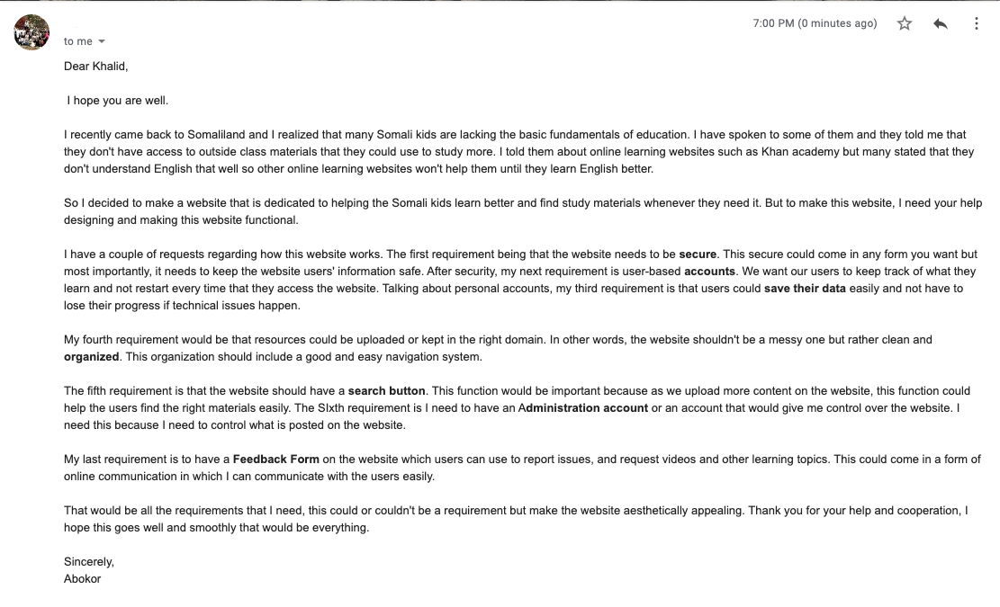
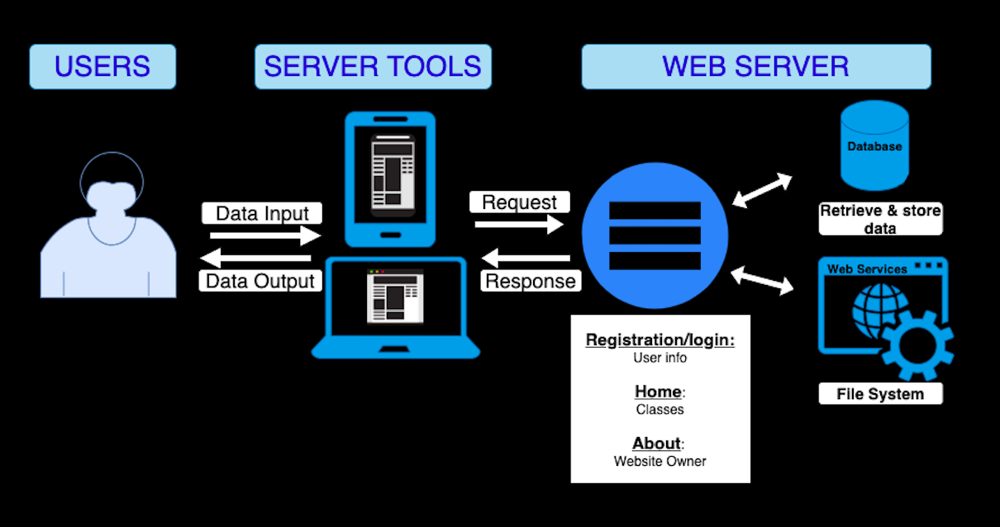
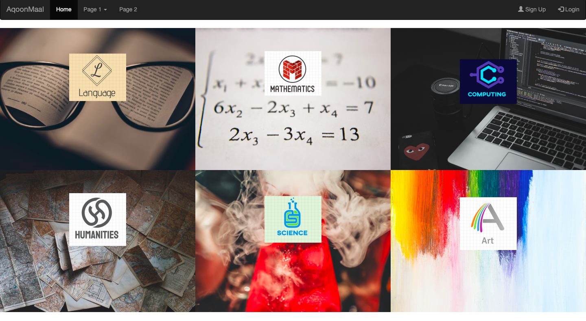
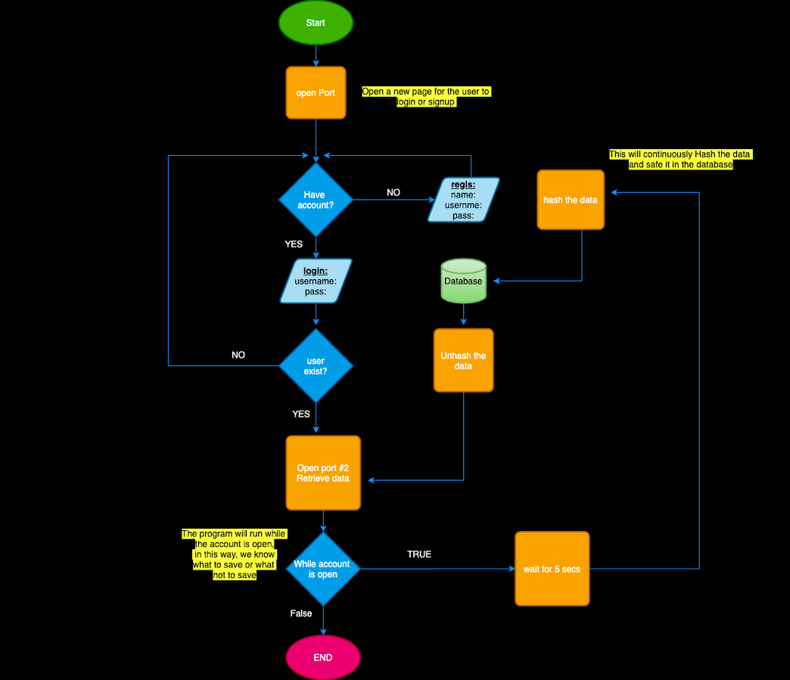
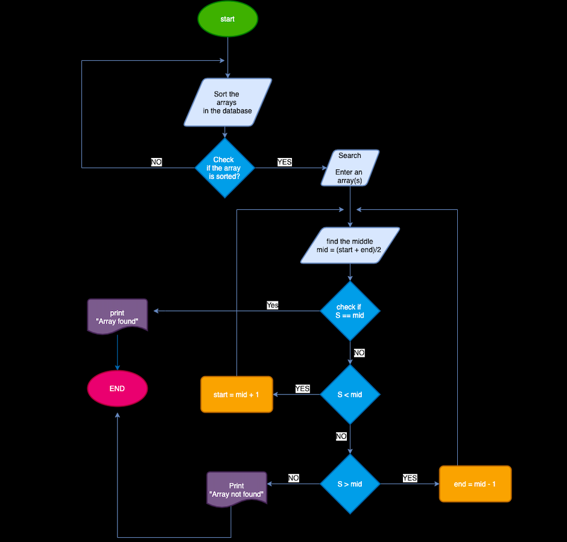

Contents
-----
  1. [Planning](#planning)
  2. [Design](#design)
  3. [Development](#development)
  4. [Evalution](#evalution)
  
   Planning 
  ----------
  # Definition of the problem
Abokor wants to help most of the Somali teenagers who are struggling with their academics to get support. He wants a platform called AqoonMaal(knowledgeseeker)in which he could upload videos that cover most of the Somali curriculums. But he faced a problem on what kind of platform that he needs and how could he make people access it for free. On top of free access, he wants to have a platform that is organized neatly, and aesthetically appealing to the users.

He wants a platform in which when you access it, one can easily see the available course and if they need any specific lessons, they could use the search mechanic to find it. The platform needs to have some sort of system in which allows the user to not lose track of their progress and all their data to be saved. He wants to show all the available courses after a user gets access to the platform and for each course, the user needs to see the subcategories available in the course. For example, if a user is interested in science, there must be a function in which he could see the sub course such as Biology, chemistry, and physics. There must be a mechanic which allows the manager to upload and edit everything that would be visible to the users.

  
  # Client Request 
  
  ### This figure will display a direct email from the client and his motives and requirements
  

**Fig.1.** Client Email 
  
  
  # Proposed Solution
To help Abokor give Somali teenagers the help they need to get better at their academics, I proposed to design a website called AqoonMaal. To make this website, I decided to use HTML, CSS, Javascript, Hash and Python for Flask to create a functional website in which users can watch videos, study and improve their skills without losing their progress data. Users can also communicate with the manager of the website via email. 

I chose to design a website due to the client’s demand for a website. All the tools that I selected to create this website are all viable for designing phase and starting with both HTML and css, they are the front end of every website page that we use a lot. JavaScript helps web developers to make web pages dynamic and interactive by implementing custom client-side scripts, and 95% of the websites use javascript for their websites (Mindfire Solutions). I decided to use Hash as I’m familiar with the encryption method that Hash uses. And Lastly, I used python due to my decision of using Flask as a framework for this website. Flask is easy to use and learn because it has less base code to implement (GeeksforGeeks).   will be added to help users know who is uploading these videos. 

  # success Criteria
  1. accounts could be created by the users
  2. securing the data - This will use Hash to encrypt all the data
  3. Autosaving mechanic - This will allow the user's data to be saved while they are login to their account
  4. clear navigation system - The website is clearly organized and the user won't have any problem navigating through it
  5. Search Button -  This button will help the user find any information in the website without taking the time to look for it
  6. Administration account -  This account will be accessible to those who manage the website and help them upload materials
  7. Feedback Form - This is a mini communication window in which the user can report issues or communicate with the manager of the website
  
  
  # Record of Tasks
  The record of task contains the five steps in the design process: Planning, Design, Developement, testing, and implementaion
  
   | __Task no__ | __Planning Action__ | __Expected Outcome__ |__Time Estimated__ |__Target Completion__ |__Criteria__ |
|-------------|---------------------|----------------------|-------------------|----------------------|-------------|
|     1       |Meeting with Client| Get an outline of the type of project that he wants. Also get a written requirements for this project and the design ideals | 1 hour | May 3rd, 2020 | A|
|      2      | SKetch of the website | create a sketch that represents the design that the client wants |  2 hours | May 5th, 2020| B |
|        3    | Defining the problem | Writing down the problem that the client issues to help build up the website. This could also help the developer to avoid any bad decisions about what is in the website |  2 hours | May 14th, 2020 | A |
|         4   | Writing Solutions on Clients's request | I need to come up with a clear solution that will solve all his requirement. These solutions will help me develope the website that he need and also outlines all of his needs | 1 hour 30 mins | May 25th, 2020 | A |
|         5   | Creating Success Criteria | I need to create success criteria as in an outline for everthing that need to be in the website. These success criterias are all based on client's needs and requirements | 1 hour| June 9th, 2020| A |
|       6     | Creating grids for each learning page | This will devide each learning course from others, it will also be easy for the user to see which course is which | 3 hours | june 23rd, 2020 | C |
|     7       | gethering free to use picture/ coding into the website | This picture will be used to make a visual application which helps the use to identify which courses are which | 1 hour | July 13th, 2020 | C |
|     8       | Designing the search button | This will help the user look for any lessons they need from any course | 2 hours | July 20th, 2020 | C |
|    9        | Create hover animation for each grid to show the available course/ create a external link in each grid | This is to help the user distinguish between course and also see the general sub courses in each grid | 4 hours | Aug 5th, 2020 | C |
|       10    | Create registration/login button | This will help the users create their own account in which they keep track on their progress in each course | 1 hour | Aug 7th, 2020 | C |
|       11    | Recreate system Diagram | This will be a better visualization and will help the user see how the website works | 2 hours |  Oct 20th, 2020 |  B | 
|       12    | Making the flowcharts | create a flowchart that can be used to create a functional code, this flowcharts will be binary search and datasaving | 2 hours |  Oct 20th, 2020 |  B |
|       13    | Coding for Database blueprint | create a blueprint that can hold all the information from the user | 2 hours |  Oct 22th, 2020 |  C |
|       14    | Coding for the registration/login | Create a functional registration/ login to help the user create an account that will keep all his progress and information | 3 hours |  Oct 24th, 2020 |  B |
|       15    | Coding for autosave | This function will help the user save all his data without them worrying about losing it | 2 hours |  Oct 25th, 2020 |  B |
|       16    | coding for the Binary Search| Create a function that will help the user search for any value and get it without any issue | 2 hours |  Oct 25th, 2020 |  B |

  
   Design 
  ----------
  ### The figure below shows an outline of the application

 

**Fig. 2.** SYSTEM DIAGRAM 

This outline of the website will demonstrate how the data flows in the website as the user puts in information to get another information.

 # WEBSITE GUI 
  
  ### This figure will display the shell of the website after the user login
  

**Fig.3.** WEBSITE GUI


### The figure below shows a flowchart for the autosave algorithm 



**Fig.4.** AUTOSAVE FLOWCHART  

  The Flowchart displays the steps that the website will take when the user opens the website. It opens a port for the user 
  and in that port, the user would be asked if they have an account or not. If they don't have an account, then they can register
  and create a new account while their data will be saved in the database with hash security. This will take the user back to the first
  page and allow them to login. Then the website will check if the new data entering is valid but checking through the database, if it 
  exists then the user will continue and start his progress. The last part of the flowchart shows how the website will keep track on the 
  progress of the user by constantly saving after every 5 seconds. 
  
  
### The figure below shows a flowchart for the autosave algorithm 



**Fig.5.** Search FLOWCHART  

The Flowchart shown in figure 4 will demonstrate an algorithm that allowed the user to find any topic from the website. 
This algorithm is called binary search as the search mechanic will sort all the array values then divide them into half 
until the search value is found. In other words, the search will repeatedly split the saved data into half until the input 
value is found and then brought into the user. I chose to use this mechanic due to it being more efficient than linear search 
and I also wanted to write a sorted algorithm within the binary search algorithm. 


  Development 
  ----------
  
  ### Importance of the Code Provided Below
  All the code provided below are a key factors that contribute the functionality of all the requirements that the client want in the website. 
  These codes consist of algorithm codes that solve a specific function to codes that make the overall website run. 
  
  ### Registration, Login, and Database
  
  #### Creating the Blueprint for Database
  ```.py
  
  class Dfile(db.Model):
    __tablename__ = 'users'
    id = database.column('id', db.Integer(1000), primary_key=TRUE)
    email = database.column('email', db.String(100))
    fn = database.column('fn', db.String(20))
    ln = database.column('ln', db.String(20))
    psw = database.column('psw', db.String(60))
    
 db.create_all()
    
  ```
  The code above provides a blueprint of the database and will give an overview on what the table that all the 
  user information will be saved. The table containes five columns and each column will contain a unique data
  so that its easier to find user's information when they visit the website again.
  
  
  #### The code blow shows the registration code algorithm
  
 ```.py
 @app.route('/signup', method=['GET', 'POST'])
def registration():
    if request.method == 'POST':
        email = request.form.get('email')
        fn = request.form.get('fn')
        ln = request.form.get('ln')
        psw = request.form.get('psw')
        psw_repeat = request.form.get('psw_repeat')
        scpsw = sha256_crypt.encrypt(str(psw))
    
    if '@' not in email:
        flash("Enter a Valid email")
        return render_template('registration.html')

    if psw == psw_repeat:
        hashpsw = sha256_crypt.encrypt(str(psw))
        db.session.add(psw)
        db.commit()
        return redirect(url_for('login.html')
    else:
        flash("Enter a Valid email")
        return render_template('registration.html')
 
 ```
 
 The code asks the user for all the important information such as their email, firstname, lastnaame,
 and password. The code also asks the user to reenter their password, the first decision starts with 
 checking if the input email is a valid one, the second decision is made when the password is compared to 
 second password to see if they match, if they do then the password is hashed and  everything is saved in the 
 database.
 
 
 #### The code blow shows the login code algorithm
 
 ```.py
  @app.route('/login', method=['GET', 'POST'])
  def login():
    if request.method == 'POST':
        email = request.form.get("email")
        psw = request.form.get("psw")

        storedemail = Dfile.query.filter_by(email).first()
        storedpsw = Dfile.query.filter_by(psw).first()
        if storedemail is None:
            flash("Please Enter an Email")

        else:
            for password in storedpsw:
                if sha256_crypt.verify(psw, password):
                    flash("login successful")
                    return redirect(url_for('index.html')
                else:
                    flash("password is incorrect")
                    return render_template('login.html')
  
  ```
  The code check if the input email and password match to that one saved in the data base.
  This is done by using query.filter_by which selects the a specific column and retrieves 
  data from there. The first decision that is made is to check if email is empty, if its 
  then you send a message, if its not empty then you check if the input password matches the 
  one saved in the database and its done by unhashing the password from the database and 
  comaparing it to the newly input one. If it matches then you login and you redirected to 
  the main page.
  
  #### Autosave 
  
  ```.py
  @app.route('/autosave')
def autosave():
    if request.method == 'POST':
        time.sleep(5)
        db.session.add()
        db.commit()
```
This code saves the progress that the user made every 5 seconds after something is changed from the database.
It does this by rewriting the database constantly allowing the user to not lose a lot of data if a problem 
arises. 

  #### Binary search code Algorith
  
```.py
  @app.route('/binarysearch')
def binary_search(array, search):
    if request.method == 'POST':
        search = form.getvalue('searchbox')
        start_item = 0
        end_item = len(array) - 1
        while array.sort():
            mid = (end_item + start_item) // 2
            midvalue = array[mid]
            if midvalue == search:
                flash("Available items")
                return mid
            elif midvalue > search:
                start_item = mid + 1
                continue
            elif midvalue < search:
                end_item = mid - 1
                continue
            else:
                flash("Available items")
                return None
```

The code shown above will show the binary search algorithm that the search function will use in the website. The 
code starts with a continues loop where the search function won't stop until the searched array is found. The algorith
starts by finding the middle of saved data and compare that to the search value, if it doesn't match then the search 
value is checked if its bigger or smaller than the middle and the process is repeated again but only in the section 
that the search value is considered to be found. 

  
  Evalution 
  ----------
